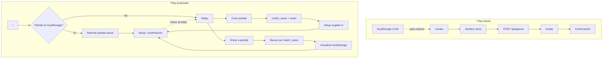
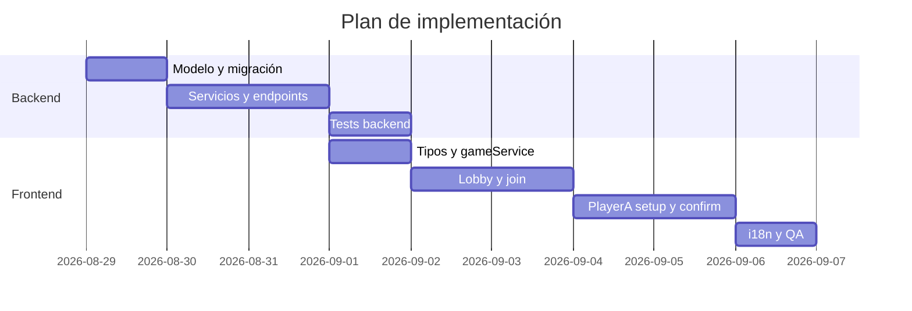

# Spec: Lobby de partidas y setup del Jugador A

**Estado:** Implementado  
**Milestone:** Post-MVP 0 (extensión del flujo de creación)  
**Ámbito:** Backend + Frontend  
**Relacionado:** [overview.md](../overview.md), [backlog §4.3](../backlog/backlog_simulador_vida_pareja.md)

---

## 1. Resumen

Hoy el frontend asume **una sola partida activa** por navegador: guarda un UUID en `localStorage` y redirige automáticamente a esa partida al visitar `/` o `/create`. No existe forma de **entrar a una partida existente** por un identificador legible, ni de elegir **modo de juego** o **sexo del jugador A**.

Este ticket introduce un **lobby** con dos caminos — crear partida nueva o entrar a una existente — y un **setup unificado del Jugador A** (nombre, avatar, sexo) con posibilidad de edición posterior. El **nombre de la partida** actúa como identificador único y **no es editable** tras la creación.

Se mantiene la **partida actual en `localStorage`** para que, al abrir la app, el usuario retome donde lo dejó sin volver a escribir el identificador. Desde cualquier pantalla de partida podrá **volver al lobby** para crear o entrar a otra.

---

## 2. Problema y motivación

| Situación actual | Impacto |
|------------------|---------|
| `localStorage` solo guarda UUID, sin `match_name` | Al retomar la partida no se muestra el identificador legible; en otro dispositivo hay que conocer el UUID |
| El identificador de partida es un UUID opaco | Difícil compartir o recordar cómo volver a una partida |
| Creación = solo nombre de la novia → avatar → confirmación | No hay modo de juego ni sexo; el setup está fragmentado en pantallas sin edición |
| `useGameRecovery` redirige siempre a la partida almacenada **sin salida al lobby** | El usuario no puede elegir otra partida sin borrar storage manualmente |
| `PATCH` ya permite actualizar nombre y avatar, pero el front bloquea re-edición del avatar | Backend parcialmente preparado; UX incompleta |

**Objetivo de producto:** que un organizador pueda crear una partida con un código memorable, configurar al Jugador A, y que otro dispositivo (o el mismo más tarde) pueda **encontrarla por ese código**. En el mismo dispositivo, la **última partida visitada** se guarda en `localStorage` y la app **arranca ahí** para no pedir el identificador dos veces; el lobby queda disponible para cambiar de partida cuando haga falta.

---

## 3. Estado actual (análisis técnico)

### 3.1 Backend

**Modelos existentes**

| Modelo | Campos relevantes | Archivo |
|--------|-------------------|---------|
| `Game` | `id` (UUID), `status`, timestamps | `backend/app/models/game.py` |
| `Player` | `game_id`, `role`, `name` (nullable), `avatar_config` 1:1 | `backend/app/models/player.py` |
| `AvatarConfig` | `config` (JSONB) | `backend/app/models/avatar_config.py` |

**Enums existentes** (`backend/app/shared/enums.py`):

- `GameStatus`: `CREATED` → `PLAYER_A_READY` → `PLAYER_B_PLAYING` → `FINISHED`
- `PlayerRole`: `partner_a`, `partner_b`

**API actual**

| Método | Ruta | Body | Notas |
|--------|------|------|-------|
| `POST` | `/api/games` | `{ partner_a_name }` | Crea `Game` + `Player` (partner_a) con nombre |
| `GET` | `/api/games/{game_id}` | — | Devuelve `GameRead` |
| `PATCH` | `/api/games/{game_id}` | `{ partner_a_name?, avatar_config? }` | Actualiza Jugador A; deriva `status` |

**Lógica de estado** (`game_service._apply_status`):

- `PLAYER_A_READY` si Jugador A tiene **nombre no vacío** y **avatar**.
- En cualquier otro caso: `CREATED`.

**Gaps respecto al ticket**

- No existe `match_name` / identificador legible de partida.
- No existe `game_mode`.
- No existe campo `sex` en `Player`.
- No hay endpoint de búsqueda por identificador de partida.
- `GameCreate` exige `partner_a_name` en el POST; el nuevo flujo podría diferir el setup del jugador.

### 3.2 Frontend

**Flujo actual**

```
/ → /create → POST /api/games → saveGameId → /games/{id}/avatar → PATCH → /games/{id}/confirm
```

**Archivos clave**

| Responsabilidad | Archivo |
|-----------------|---------|
| Almacenamiento único | `frontend/src/shared/gameStorage.ts` |
| Recuperación automática | `frontend/src/hooks/useGameRecovery.ts` |
| Crear partida | `frontend/src/pages/CreateGamePage.tsx` |
| Avatar | `frontend/src/pages/AvatarBuilderPage.tsx` |
| Confirmación | `frontend/src/pages/ConfirmationPage.tsx` |

**Comportamiento de recuperación:** si hay UUID en storage y la partida existe, redirige a `/avatar` o `/confirm` sin preguntar al usuario.

**Edición:** si el avatar ya existe, `AvatarBuilderPage` redirige a confirmación; no hay UI de edición.

### 3.3 Diagrama del flujo actual vs. propuesto



---

## 4. Alcance

### 4.1 In scope

1. **Lobby inicial** con opciones: crear partida nueva / entrar a partida existente.
2. **Identificador de partida** (`match_name`): único, legible, inmutable tras creación, usado para encontrar la partida.
3. **Modo de partida** (`game_mode`): columna en BD con choice/enum; valor inicial único: **modo en pareja** (`couple`).
4. **Setup del Jugador A** en un flujo coherente:
   - Nombre
   - Avatar (subset DiceBear existente)
   - Sexo: `male` | `female` | `prefer_not_to_say`
5. **Edición del Jugador A** cuando ya está definido: mismo formulario que en creación.
6. **Mantener la partida actual en `localStorage`** y retomarla al abrir la app (`/`), ampliando el objeto guardado con `match_name`. Añadir **acceso explícito al lobby** (`/lobby`) para crear o entrar a otra partida sin borrar storage a mano.
7. Migración Alembic, tests backend, i18n frontend, actualización de tipos y servicios API.

### 4.2 Out of scope (este ticket)

- Autenticación / permisos (cualquiera con el `match_name` o UUID puede acceder; igual que hoy con UUID).
- Flujo del Jugador B.
- Listado paginado de todas las partidas del sistema.
- Cambio de modo de partida después de crear.
- Renombrar partida.
- Validación avanzada de `match_name` (reservadas, palabras prohibidas, etc.) — solo reglas básicas.
- Modos de juego adicionales más allá de definir el enum y el default.

---

## 5. Modelo de dominio propuesto

### 5.1 Cambios en `Game`

| Campo | Tipo | Restricciones | Notas |
|-------|------|---------------|-------|
| `match_name` | `String` | `UNIQUE`, `NOT NULL`, índice | Identificador legible; inmutable |
| `game_mode` | `String` (enum) | `NOT NULL`, default `couple` | Extensible a futuros modos |

**Nuevo enum `GameMode`** (en `app/shared/enums.py`):

```python
class GameMode(str, Enum):
    COUPLE = "couple"
```

### 5.2 Cambios en `Player`

| Campo | Tipo | Restricciones | Notas |
|-------|------|---------------|-------|
| `sex` | `String` (enum), nullable | — | Obligatorio para `PLAYER_A_READY` (ver reglas de estado) |

**Nuevo enum `PlayerSex`**:

```python
class PlayerSex(str, Enum):
    MALE = "male"
    FEMALE = "female"
    PREFER_NOT_TO_SAY = "prefer_not_to_say"
```

### 5.3 Reglas de negocio

| Regla | Detalle |
|-------|---------|
| Unicidad de `match_name` | Case-insensitive recomendado (normalizar a minúsculas en BD o al comparar) |
| Inmutabilidad | `match_name` solo en `GameCreate`; ausente en `GameUpdate` |
| `game_mode` en creación | Requerido en API; si el cliente no envía valor, default `couple` |
| `game_mode` post-creación | No editable en este ticket |
| Setup completo Jugador A | Nombre + avatar + sexo → `PLAYER_A_READY` |
| Setup incompleto | `CREATED` |
| Edición Jugador A | Permitida vía `PATCH`; no afecta `match_name` ni `game_mode` |

**Propuesta de actualización de `_apply_status`:**

```
PLAYER_A_READY  iff  name non-empty AND avatar exists AND sex is set
CREATED         otherwise
```

### 5.4 Formato de `match_name`

Propuesta para V1 (ajustable en revisión):

| Regla | Valor |
|-------|-------|
| Longitud | 3–32 caracteres |
| Caracteres permitidos | `a-z`, `0-9`, `-`, `_` (sin espacios) |
| Normalización | Trim + lowercase al guardar |
| Unicidad | Índice único sobre valor normalizado |
| Ejemplos válidos | `boda-ana-luis`, `despedida2026` |

**Alternativa considerada:** permitir espacios y mayúsculas visibles al usuario pero normalizar internamente. Se descarta en V1 por simplicidad de búsqueda y URLs.

---

## 6. API

### 6.1 Endpoints nuevos / modificados

#### `POST /api/games` — Crear partida

**Request (propuesto):**

```json
{
  "match_name": "boda-ana-luis",
  "game_mode": "couple",
  "partner_a_name": "María",
  "partner_a_sex": "female",
  "avatar_config": { "...": "..." }
}
```

**Decisiones de diseño a cerrar:**

| Opción | Descripción | Recomendación |
|--------|-------------|---------------|
| **A — Creación mínima** | POST solo crea partida (`match_name`, `game_mode`); setup Jugador A vía PATCH posterior | Separa “crear partida” de “configurar jugador”; más llamadas HTTP |
| **B — Creación + setup opcional** | POST acepta campos de Jugador A opcionales; PATCH para completar/editar | **Recomendada:** flexibilidad sin forzar todo en una pantalla |
| **C — Creación atómica** | POST exige todos los campos de Jugador A | Simple pero empeora UX si el usuario abandona a mitad |

**Recomendación: Opción B**

- `POST` requiere: `match_name`, `game_mode` (default `couple`).
- `POST` opcional: `partner_a_name`, `partner_a_sex`, `avatar_config`.
- Crea `Game` + `Player` (partner_a) con los datos disponibles.

**Response `GameRead` (ampliado):**

```json
{
  "data": {
    "id": "uuid",
    "match_name": "boda-ana-luis",
    "game_mode": "couple",
    "status": "created",
    "partner_a": {
      "name": "María",
      "sex": "female",
      "avatar_config": { }
    }
  }
}
```

**Errores:**

| Código | HTTP | Cuándo |
|--------|------|--------|
| `MATCH_NAME_TAKEN` | 409 | `match_name` ya existe |
| `VALIDATION_ERROR` | 422 | Formato inválido de `match_name` |

#### `GET /api/games/by-match-name/{match_name}` — Buscar partida

Nuevo endpoint dedicado (preferible a query en colección por claridad REST y validación de path).

- Normaliza `match_name` del path igual que en creación.
- 404 `GAME_NOT_FOUND` si no existe.
- Response: mismo `GameRead`.

**Alternativa:** `GET /api/games?match_name=...` — válida pero menos explícita; se prefiere path param para un lookup único.

#### `GET /api/games/{game_id}` — Sin cambios de ruta

Incluir `match_name`, `game_mode`, `partner_a.sex` en la respuesta.

#### `PATCH /api/games/{game_id}` — Actualizar Jugador A

**Request (ampliado):**

```json
{
  "partner_a_name": "María",
  "partner_a_sex": "female",
  "avatar_config": { }
}
```

- Al menos un campo requerido (sin cambio).
- `match_name` y `game_mode` **no aceptados** (ignorar o 422 si se envían).
- Actualiza estado según reglas de §5.3.

#### `GET /api/games/{game_id}/invite` — Enlace de invitación

Devuelve la ruta y URL pública para compartir la partida.

**Response:**

```json
{
  "data": {
    "game_id": "uuid",
    "match_name": "boda-ana-luis",
    "invite_path": "/games/join/boda-ana-luis",
    "invite_url": "http://localhost:5173/games/join/boda-ana-luis"
  }
}
```

- `invite_path`: ruta relativa del frontend; el cliente puede construir la URL con `window.location.origin` si `invite_url` es `null`.
- `invite_url`: URL absoluta cuando `FRONTEND_PUBLIC_URL` está configurada en el backend.
- 404 `GAME_NOT_FOUND` si la partida no existe.
- El enlace abre `/games/join/{match_name}` y une automáticamente a la partida.

### 6.2 Compatibilidad con MVP 0

El contrato actual (`POST` con solo `partner_a_name`) **dejará de ser válido** si `match_name` pasa a ser obligatorio. Es un **breaking change** aceptable post-MVP 0:

- Actualizar tests en `backend/tests/test_api_games.py` y `test_game_service.py`.
- Actualizar `frontend/src/services/gameService.ts` y tipos asociados en el mismo PR.

---

## 7. Frontend — UX y rutas

### 7.1 Pantallas

#### Pantalla 0: Punto de entrada (`/`)

Comportamiento al abrir la app:

1. Si hay **partida actual** en `localStorage` → `GET /api/games/{game_id}`.
   - Si existe → redirigir al paso correspondiente (`/games/{id}/player-a` o `/games/{id}/confirm` según estado).
   - Si 404 → limpiar storage → redirigir a `/lobby`.
2. Si no hay partida guardada → redirigir a `/lobby`.

Así el usuario **no tiene que volver a escribir el `match_name`** en visitas habituales. Evolución de `useGameRecovery`, no su eliminación.

#### Pantalla 1: Lobby (`/lobby`)

```
┌─────────────────────────────────────┐
│  Couple Life Simulator              │
│                                     │
│  [ Crear nueva partida ]            │
│  [ Entrar a una partida ]           │
│                                     │
│  Partida actual (si hay en storage):│
│  boda-ana-luis  [ Continuar ]       │
└─────────────────────────────────────┘
```

- **Sin auto-redirect** desde `/lobby`: el usuario llega aquí explícitamente (enlace “Volver al lobby” u URL directa).
- Si hay partida en storage, mostrar atajo **Continuar** con el `match_name` guardado (opcional pero recomendado).
- Al crear o entrar a una partida, actualizar la partida actual en `localStorage`.

#### Pantalla 2a: Crear partida (`/games/new`)

Campos:

1. **Nombre de partida** (`match_name`) — con hint de formato y unicidad.
2. **Modo de partida** — select; por ahora solo “En pareja” (`couple`), deshabilitado o con una sola opción visible.

Acción: crear partida → navegar a setup Jugador A.

#### Pantalla 2b: Entrar a partida (`/games/join`)

Campo:

1. **Nombre de partida** (`match_name`)

Acción: `GET by-match-name` → si existe, **guardar como partida actual** en `localStorage` → navegar a setup/confirmación según estado.

#### Pantalla 3: Setup / edición Jugador A (`/games/{gameId}/player-a`)

Formulario **único** para creación y edición:

| Campo | Componente |
|-------|------------|
| Nombre | Input texto |
| Sexo | Radio group o select: Hombre / Mujer / Prefiero no decirlo |
| Avatar | `AvatarBuilder` existente (cargar config actual si hay) |

- Título dinámico: “Configura tu personaje” vs “Editar personaje”.
- Botón: “Guardar” → `PATCH` (o `POST`+`PATCH` según flujo).
- Tras guardar con setup completo → `/games/{gameId}/confirm` o dashboard.

**Cambio respecto a hoy:** `AvatarBuilderPage` debe **precargar** `avatar_config` existente y **no redirigir** automáticamente si el objetivo es editar.

#### Pantalla 4: Confirmación / resumen (`/games/{gameId}/confirm`)

Mostrar:

- Nombre de partida (`match_name`) — solo lectura.
- Modo de partida.
- Jugador A: nombre, sexo, avatar.
- Acción: **Editar jugador A** → `/games/{gameId}/player-a`.
- Acción: **Volver al lobby** → `/lobby` (la partida sigue en el servidor y en `localStorage` como “actual”).
- UUID interno puede mostrarse como referencia secundaria o ocultarse.

**Navegación “Volver al lobby”:** visible en confirmación, setup Jugador A y, si aplica, otras pantallas de partida. No borra `localStorage`; solo cambia de ruta.

### 7.2 Rutas propuestas

| Ruta | Componente | Notas |
|------|------------|-------|
| `/` | `EntryPage` o hook en layout | Recupera partida actual → redirect; si no hay, → `/lobby` |
| `/lobby` | `LobbyPage` | Crear / entrar / continuar partida guardada |
| `/games/new` | `CreateMatchPage` | Reemplaza `/create` |
| `/games/join` | `JoinMatchPage` | Nueva |
| `/games/:gameId/player-a` | `PlayerASetupPage` | Unifica create + edit avatar/nombre/sexo |
| `/games/:gameId/confirm` | `ConfirmationPage` | Ampliada |
| `/create` | redirect → `/lobby` o `/games/new` | Compat temporal |
| `/games/:gameId/avatar` | redirect → `/games/:gameId/player-a` | Compat temporal |

### 7.3 Almacenamiento local — partida actual

Se **conserva** el concepto de partida actual en el dispositivo. Objetivo: **retomar sin repetir el `match_name`**, con salida clara al lobby.

#### Clave y forma

| Clave | Propósito |
|-------|-----------|
| `couple_simulator_current_game` | Partida activa en este navegador (nueva) |
| `couple_simulator_game_id` | Legacy MVP 0 — migrar o leer como fallback |

**Valor propuesto** (`couple_simulator_current_game`):

```json
{
  "game_id": "3fa85f64-5717-4562-b3fc-2c963f66afa6",
  "match_name": "boda-ana-luis",
  "last_visited_at": "2026-08-28T18:00:00.000Z"
}
```

#### Cuándo escribir

| Evento | Acción |
|--------|--------|
| Crear partida (`POST` OK) | Guardar `game_id` + `match_name` |
| Entrar por `match_name` (`GET by-match-name` OK) | Sobrescribir partida actual |
| Navegar dentro de una partida (setup, confirm) | Actualizar `last_visited_at` (opcional) |
| Partida no encontrada (404) | `clearCurrentGame()` |
| Usuario pulsa “Volver al lobby” | **No borrar** storage |

#### Cuándo leer

| Ruta | Comportamiento |
|------|----------------|
| `/` | Si hay partida actual válida → redirect al paso de esa partida |
| `/lobby` | Mostrar atajo “Continuar: {match_name}” si hay storage |
| Resto | No auto-redirect |

#### Cambio de partida

1. Usuario en `/lobby` → “Entrar a partida” o “Crear nueva”.
2. Al confirmar join/create → **sobrescribe** `couple_simulator_current_game`.
3. La partida anterior sigue en el servidor; solo deja de ser la “actual” en este navegador.

#### API de `gameStorage.ts` (propuesta)

```typescript
type StoredCurrentGame = {
  game_id: string;
  match_name: string;
  last_visited_at: string;
};

saveCurrentGame(game: StoredCurrentGame): void;
getCurrentGame(): StoredCurrentGame | null;
clearCurrentGame(): void;
// Migración: si solo existe couple_simulator_game_id, GET game y rellenar match_name
```

**No se requiere** en V1 una lista separada de “partidas recientes”: la partida actual + lobby cubren el caso de uso principal. Una lista multi-partida puede añadirse después si hace falta.

### 7.4 i18n

Nuevas claves sugeridas (inglés en archivos, español en traducción):

```
game.lobby.title
game.lobby.createButton
game.lobby.joinButton
game.lobby.continueCurrent
game.lobby.currentMatchLabel
game.nav.backToLobby
game.create.matchNameLabel
game.create.matchNameHint
game.create.gameModeLabel
game.create.gameMode.couple
game.join.title
game.join.matchNameLabel
game.join.notFound
game.playerA.title
game.playerA.editTitle
game.playerA.sexLabel
game.playerA.sex.male
game.playerA.sex.female
game.playerA.sex.preferNotToSay
game.confirm.matchName
game.confirm.gameMode
game.confirm.editPlayerA
errors.matchNameTaken
```

---

## 8. Plan de implementación

Orden sugerido para minimizar riesgo y permitir revisión incremental.

### Fase 1 — Backend: modelo y API (≈1 PR)

1. Añadir enums `GameMode`, `PlayerSex`.
2. Añadir columnas `games.match_name`, `games.game_mode`, `players.sex`.
3. Usuario ejecuta: `make makemigrations MSG='add match_name game_mode and player sex'`.
4. Actualizar schemas: `GameCreate`, `GameUpdate`, `GameRead`, `PartnerARead`.
5. Actualizar `game_service`: create, update, `_apply_status`, lookup por `match_name`.
6. Nuevo router handler: `GET /api/games/by-match-name/{match_name}`.
7. Tests: unicidad, lookup, setup completo/incompleto, sexo en status.

### Fase 2 — Frontend: servicios y tipos (≈1 PR o junto con Fase 3)

1. Actualizar tipos TypeScript de `Game`.
2. `gameService`: `createGame`, `getGameByMatchName`, `updateGame` con nuevos campos.
3. Ampliar `gameStorage` (`saveCurrentGame`, migración desde `game_id` legacy).

### Fase 3 — Frontend: lobby y flujos (≈1–2 PR)

1. `LobbyPage`, `CreateMatchPage`, `JoinMatchPage`.
2. `PlayerASetupPage` (refactor de create + avatar + sexo).
3. Actualizar `ConfirmationPage` con edición y `match_name` read-only.
4. Ajustar rutas en `App.tsx`; redirects de compatibilidad.
5. Evolucionar `useGameRecovery` → recuperación en `/` solamente; lobby en `/lobby` sin auto-redirect.
6. i18n EN + ES.

### Fase 4 — Pulido y documentación

1. Actualizar `docs/overview.md` (criterio MVP 0 ampliado).
2. Marcar ítems relevantes en backlog.
3. `make pre-commit-run`, `make test`, `make typecheck`, `make lint-frontend`, `npm run build`.



---

## 9. Criterios de aceptación

### Crear partida

- [x] Desde el lobby puedo crear una partida con `match_name` único y modo “En pareja”.
- [x] Si el `match_name` ya existe, veo un error claro (`MATCH_NAME_TAKEN`).
- [x] Tras crear, puedo configurar Jugador A (nombre, sexo, avatar) en un solo formulario.
- [x] El `match_name` no aparece como editable en ninguna pantalla posterior.

### Entrar a partida

- [x] Desde el lobby puedo entrar escribiendo un `match_name` existente.
- [x] Si no existe, veo error amigable.
- [x] Al entrar, veo el estado actual (setup incompleto → formulario; completo → confirmación).

### Editar Jugador A

- [x] Si Jugador A ya tiene datos, puedo abrir el mismo formulario y modificarlos.
- [x] Los cambios persisten tras recargar la página.
- [x] El avatar existente se muestra en el builder al editar.

### Partida actual y lobby

- [x] Al abrir `/`, si tengo partida en `localStorage`, entro directamente sin escribir el `match_name` otra vez.
- [x] Desde setup o confirmación puedo **Volver al lobby** sin perder la partida en el servidor.
- [x] Desde el lobby puedo crear o entrar a otra partida; eso actualiza la partida actual en `localStorage`.
- [x] En el lobby, si hay partida guardada, veo un atajo **Continuar** con el `match_name`.
- [x] Si la partida guardada ya no existe (404), se limpia el storage y veo el lobby.
- [x] Puedo copiar un enlace de invitación desde la confirmación y compartirlo.

### Backend

- [x] `PLAYER_A_READY` solo cuando nombre + avatar + sexo están definidos.
- [x] Tests automatizados cubren los casos anteriores.

---

## 10. Riesgos y mitigaciones

| Riesgo | Mitigación |
|--------|------------|
| Colisión de nombres de partida | Índice único + normalización; mensaje 409 claro |
| Enumeración de partidas (adivinar nombres) | Aceptable en V1 sin auth; documentar; rate limiting futuro |
| Breaking change en API | Actualizar front y tests en el mismo ciclo de release |
| Complejidad al unificar avatar + nombre + sexo | Una página `PlayerASetupPage` y un hook `usePlayerASetup` |
| Migración de datos existentes | Partidas sin `match_name`: migración con valor generado o tabla vacía si no hay prod |

**Migración de datos:** si hay partidas en BD de desarrollo/staging, la migración debe asignar `match_name` temporal único (p. ej. prefijo `game-` + primeros 8 chars del UUID) o fallar con script manual. Definir en la revisión de la migración autogenerada.

---

## 11. Preguntas abiertas

| # | Pregunta | Propuesta por defecto |
|---|----------|----------------------|
| 1 | ¿`match_name` case-insensitive? | Sí — guardar normalizado en minúsculas |
| 2 | ¿El setup Jugador A es en la misma pantalla que crear partida o en paso siguiente? | Paso siguiente (`/games/new` → `/games/{id}/player-a`) |
| 3 | ¿Mostrar UUID en confirmación? | Opcional, texto secundario; el usuario usa `match_name` |
| 4 | ¿Nombre del campo API: `match_name` vs `slug` vs `code`? | `match_name` — alineado con “nombre de partida” del ticket |
| 5 | ¿Traducciones del modo “En pareja”? | Clave `game.create.gameMode.couple` |
| 6 | ¿Sexo obligatorio antes de `PLAYER_A_READY`? | Sí, según ticket |
| 7 | ¿Lista de partidas recientes en localStorage? | **Cerrado:** no en V1; basta partida actual + lobby |
| 8 | ¿Retomar partida al abrir la app? | **Cerrado:** sí, en `/`; lobby explícito en `/lobby` |

---

## 12. Checklist de archivos a tocar

### Backend

- `app/shared/enums.py`
- `app/models/game.py`, `app/models/player.py`
- `app/schemas/game.py`
- `app/services/game_service.py`
- `app/routers/games.py`
- `tests/test_api_games.py`, `tests/test_game_service.py`
- Migración Alembic (autogenerada)

### Frontend

- `src/App.tsx`
- `src/pages/` — nuevas: `LobbyPage`, `CreateMatchPage`, `JoinMatchPage`, `PlayerASetupPage`
- `src/pages/ConfirmationPage.tsx`
- `src/hooks/` — `useCreateGame`, `useAvatarBuilder`, `useGameRecovery`, nuevo `usePlayerASetup`, `useJoinGame`
- `src/services/gameService.ts`
- `src/shared/gameStorage.ts`
- `src/locales/en.json` (+ `es.json` si existe)
- `src/components/avatar/AvatarBuilder.tsx` — soporte de valor inicial

---

## 13. Referencias de código actual

Creación de partida (solo nombre):

```80:90:backend/app/services/game_service.py
def create_game(db: Session, payload: GameCreate) -> GameRead:
    game = Game(status=GameStatus.CREATED.value)
    partner_a = Player(
        role=PlayerRole.PARTNER_A.value,
        name=payload.partner_a_name,
    )
    game.players.append(partner_a)
    db.add(game)
    db.commit()
```

Recuperación automática en frontend:

```11:29:frontend/src/hooks/useGameRecovery.ts
  useEffect(() => {
    const isRecoveryRoute =
      location.pathname === "/" || location.pathname === "/create";
    if (!isRecoveryRoute) return;

    const storedId = getStoredGameId();
    if (!storedId) return;

    getGame(storedId)
      .then((game) => {
        if (game.partner_a.avatar_config) {
          navigate(`/games/${storedId}/confirm`, { replace: true });
        } else {
          navigate(`/games/${storedId}/avatar`, { replace: true });
        }
      })
```

---

## 14. Próximo paso

Revisar este spec y cerrar las **preguntas abiertas** restantes (§11), especialmente:

1. Formato exacto de `match_name`.
2. Si el setup Jugador A va en pantalla separada o combinada con crear partida.

**Decidido:** partida actual en `localStorage`, arranque en `/` retomando esa partida; lobby en `/lobby` con enlace “Volver al lobby” desde las pantallas de juego.

Tras aprobación, implementar en el orden de **§8** empezando por backend (Fase 1).
